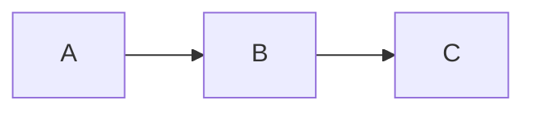

# obsidian-markdown

Quick reference. No multi-step procedure — this is a knowledge skill that other skills consult.

## Wikilinks

```
[[Page Name]]                  → link to "Page Name.md" in the vault
[[Page Name|Display Text]]     → link with custom display
[[Folder/Page Name]]           → fully qualified path (use when name is ambiguous)
[[Page#Heading]]               → link to a specific heading inside a page
[[Page^block-id]]              → link to a specific block (block ref)
[[Page#^block-id|Display]]     → block link with display text
```

Resolution: Obsidian resolves `[[Foo]]` against all pages in the vault, picking the first match. If two pages are named `Foo`, use the folder-prefixed form to disambiguate.

## Embeds

Embeds inline content from another page or file:

```
![[Page Name]]                 → embed full page (renders as transclusion)
![[Page Name#Heading]]          → embed only that section
![[Page Name#^block-id]]        → embed only that block
![[image.png]]                  → embed image (alt: standard markdown )
![[image.png|400]]              → embed image with width 400
![[file.pdf]]                   → embed PDF (renders as PDF viewer)
```

## Frontmatter (properties)

YAML at the top of the file. Obsidian's "Properties" feature reads/writes this:

```yaml
---
title: "Page Title"
tags: [project, active]        # or single string: tags: project
created: 2026-05-03
status: in-progress
related: ["[[Other Page]]"]    # wikilinks inside frontmatter use quoted strings
---
```

Common pitfalls:
- Use lowercase keys for system-recognized properties (`tags`, not `Tags`).
- Wikilinks in frontmatter MUST be quoted strings — unquoted YAML interprets `[[X]]` as a list.
- Date values without quotes parse as date type; with quotes, as string.

## Tags

```
#tag                          → a tag (renders as link in body)
#nested/tag                   → nested tag (creates hierarchy in tag pane)
```

Tags inside frontmatter `tags:` array don't need the `#` prefix.

## Callouts

```
> [!note] Optional title
> Body of the callout.
> Multi-line is fine.

> [!warning]
> No title is fine too.

> [!info]+ Foldable, default open
> Body...

> [!warning]- Foldable, default closed
> Body...
```

Common types: `note`, `info`, `tip`, `success`, `warning`, `danger`, `bug`, `example`, `quote`, `abstract`. Custom types render as `note` style if Obsidian doesn't recognize them.

## Highlights

```
==highlighted text==          → renders with yellow background
```

## Math

```
Inline: $E = mc^2$            → MathJax, renders inline
Block:
$$
\sum_{i=1}^n i = \frac{n(n+1)}{2}
$$
```

## Block references

Tag a paragraph or block with an ID so other pages can link to it:

```
This is an important paragraph. ^my-id
```

Reference it: `[[Page#^my-id]]` or embed: `![[Page#^my-id]]`.

Block IDs must be alphanumeric (and hyphens). They can be auto-generated by Obsidian via right-click → "Copy block link".

## Footnotes

```
Some claim.[^1]

[^1]: The footnote body, can span multiple lines.
```

## Comments

```
%%This is an inline comment, not rendered.%%

%%
Block comment,
multi-line, not rendered.
%%
```

Useful for TODOs in wiki pages that you don't want to surface in views.

## Internal links to headings

```
[[Page#Heading Name]]          → exact heading text
[[#Heading In This Same Page]] → without page name = same-page link
```

Heading text must match exactly (case-sensitive, including spaces).

## Tables

Standard GFM tables work. For long content cells, use `<br>` for line breaks (markdown line breaks don't work inside table cells).

```
| Col A | Col B |
|---|---|
| Short cell | Multi<br>line<br>cell |
```

## Code blocks

Standard fenced code blocks. Obsidian recognizes language hints for syntax highlighting:

```` ```python ... ``` ````

Special: `dataviewjs`, `dataview`, and `meta-bind` are plugin-specific and render as live queries/forms when those plugins are installed. Don't generate these unless explicitly asked.

## Mermaid diagrams

```

```

Renders as a flowchart. Useful for wiki pages that document processes.

## Obsidian-specific don'ts

- Don't use `<a href="...">` HTML when a markdown link will do. Obsidian renders both, but markdown is more portable.
- Don't put YAML frontmatter anywhere except the very top of the file (must start at line 1).
- Don't use raw HTML for headings — `# Heading` is parsed; `<h1>Heading</h1>` is rendered as text in some configs.
- Don't use `` inline images in wiki pages — they bloat the file. Save the image to `_attachments/` and embed: `![[image.png]]`.

## Style guidance for wiki pages (when writing via wiki-ingest, save, etc.)

- Lead with a 1-paragraph definition or summary.
- Use `## See also` (not "Related" or "Links") at the bottom — this is the convention the wiki-lint skill assumes.
- Put cross-references as wikilinks, not raw URLs.
- Frontmatter `type:` is the most important property — every page should have it. Common values: `entity`, `concept`, `source`, `answer`, `decision`, `technique`, `idea`, `session`, `program`, `fold`.
- Date fields use ISO 8601 (`2026-05-03` or `2026-05-03T14:00:00Z`).
